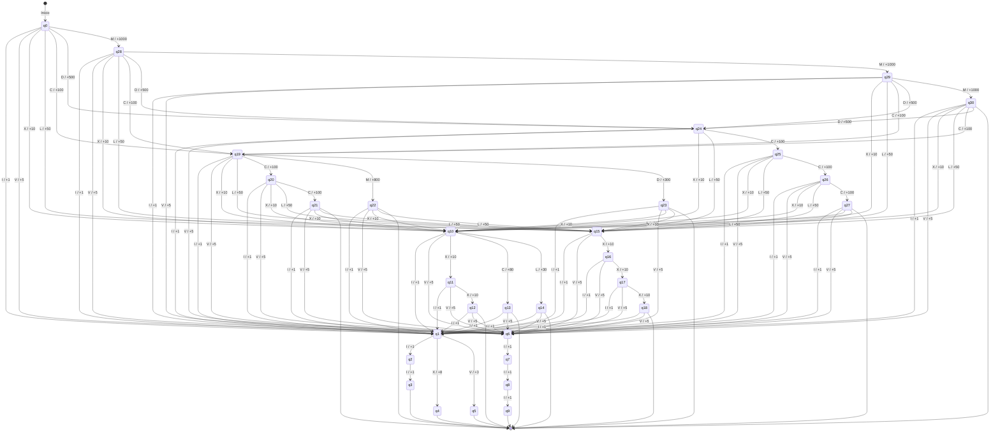

```mermaid
stateDiagram-v2
    [*] --> q0 : Início
    q0 --> q1 : I / +1
    q1 --> q2 : I / +1
    q2 --> q3 : I / +1
    q0 --> q6 : V / +5
    q6 --> q7 : I / +1
    q7 --> q8 : I / +1
    q8 --> q9 : I / +1
    q1 --> q4 : X / +8
    q1 --> q5 : V / +3


    q10 --> q1 : I / +1
    q10 --> q6 : V / +5

    q11 --> q1 : I / +1
    q11 --> q6 : V / +5

    q12 --> q1 : I / +1
    q12 --> q6 : V / +5

    q13 --> q1 : I / +1
    q13 --> q6 : V / +5

    q14 --> q1 : I / +1
    q14 --> q6 : V / +5

    q15 --> q1 : I / +1
    q15 --> q6 : V / +5

    q16 --> q1 : I / +1
    q16 --> q6 : V / +5

    q17 --> q1 : I / +1
    q17 --> q6 : V / +5

    q18 --> q1 : I / +1
    q18 --> q6 : V / +5


    q0 --> q10 : X / +10
    q10 --> q11 : X / +10
    q11 --> q12 : X / +10
    q10 --> q13 : C / +80
    q10 --> q14 : L / +30
    q0 --> q15 : L / +50
    q15 --> q16 : X / +10
    q16 --> q17 : X / +10
    q17 --> q18 : X / +10


    q19 --> q1 : I / +1
    q19 --> q6 : V / +5
    q19 --> q10 : X / +10
    q19 --> q15 : L / +50

    q20 --> q1 : I / +1
    q20 --> q6 : V / +5
    q20 --> q10 : X / +10
    q20 --> q15 : L / +50

    q21 --> q1 : I / +1
    q21 --> q6 : V / +5
    q21 --> q10 : X / +10
    q21 --> q15 : L / +50

    q22 --> q1 : I / +1
    q22 --> q6 : V / +5
    q22 --> q10 : X / +10
    q22 --> q15 : L / +50

    q23 --> q1 : I / +1
    q23 --> q6 : V / +5
    q23 --> q10 : X / +10
    q23 --> q15 : L / +50

    q24 --> q1 : I / +1
    q24 --> q6 : V / +5
    q24 --> q10 : X / +10
    q24 --> q15 : L / +50

    q25 --> q1 : I / +1
    q25 --> q6 : V / +5
    q25 --> q10 : X / +10
    q25 --> q15 : L / +50

    q26 --> q1 : I / +1
    q26 --> q6 : V / +5
    q26 --> q10 : X / +10
    q26 --> q15 : L / +50

    q27 --> q1 : I / +1
    q27 --> q6 : V / +5
    q27 --> q10 : X / +10
    q27 --> q15 : L / +50


    q0 --> q19 : C / +100
    q19 --> q20 : C / +100
    q20 --> q21 : C / +100
    q19 --> q22 : M / +800
    q19 --> q23 : D / +300
    q0 --> q24 : D / +500
    q24 --> q25 : C / +100
    q25 --> q26 : C / +100
    q26 --> q27 : C / +100


    q28 --> q1 : I / +1
    q28 --> q6 : V / +5
    q28 --> q10 : X / +10
    q28 --> q15 : L / +50
    q28 --> q19 : C / +100
    q28 --> q24 : D / +500

    q29 --> q1 : I / +1
    q29 --> q6 : V / +5
    q29 --> q10 : X / +10
    q29 --> q15 : L / +50
    q29 --> q19 : C / +100
    q29 --> q24 : D / +500

    q30 --> q1 : I / +1
    q30 --> q6 : V / +5
    q30 --> q10 : X / +10
    q30 --> q15 : L / +50
    q30 --> q19 : C / +100
    q30 --> q24 : D / +500


    q0 --> q28 : M / +1000
    q28 --> q29 : M / +1000
    q29 --> q30 : M / +1000


    q3 --> [*]
    q4 --> [*]
    q5 --> [*]
    q9 --> [*]
    q12 --> [*]
    q13 --> [*]
    q14 --> [*]
    q18 --> [*]
    q21 --> [*]
    q22 --> [*]
    q23 --> [*]
    q27 --> [*]
    q30 --> [*]
```
