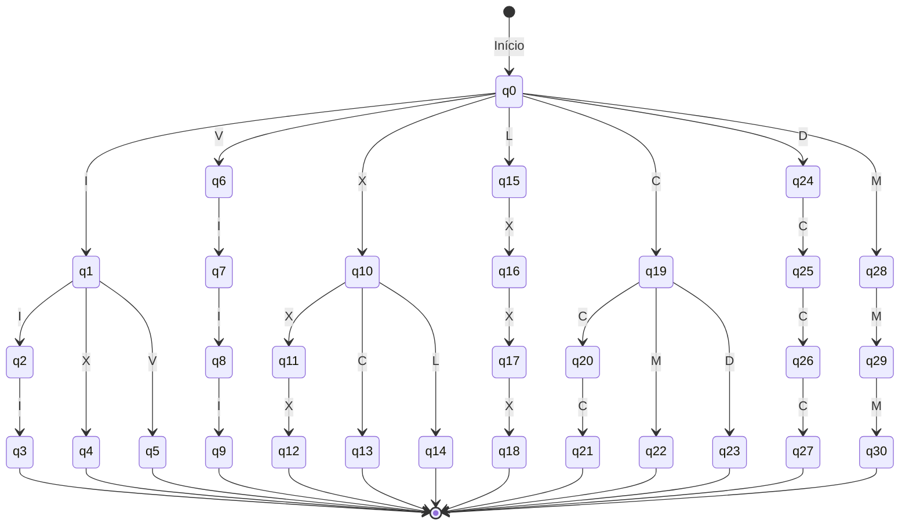

# Autômato Finito Determinístico (ADF) para Números Romanos

Este projeto implementa um **Autômato Finito Determinístico (ADF)** em Ruby que reconhece e converte números romanos em valores inteiros. O autômato processa símbolos como `I`, `V`, `X`, `L`, `C`, `D` e `M` e calcula o valor correspondente de acordo com as regras de numeração romana.

---

## Funcionalidades

- Reconhecimento de números romanos válidos de `1` a `3999`.
- Cálculo do valor inteiro correspondente.
- Mensagens detalhadas de estado e saída parcial durante a execução.
- Estrutura de estados organizada em unidades de 1s, 10s, 100s e 1000s.

---

## Como usar

1. Clone ou baixe o repositório.
2. Execute o arquivo Ruby:

```bash
ruby ver01.rb
```

Modifique a entrada no final do arquivo para testar outros números romanos:

adf = ADF.new("MMMCMXCIX") # 3999
adf.iniciar

O programa mostrará:

Símbolo processado

Estado atual

Saída parcial

Saída final se o número for válido

Mensagem de erro se a sequência não for reconhecida

Diagrama de Estados

O diagrama abaixo mostra a lógica de transição de estados do autômato:



# Autômato Finito Determinístico (AFD) para Números Romanos

Este projeto implementa um **Autômato Finito Determinístico (AFD)** — especificamente um Transdutor Finito — em **Ruby**. O sistema é capaz de reconhecer e converter números romanos em valores inteiros (decimais), processando os símbolos `I`, `V`, `X`, `L`, `C`, `D` e `M` seguindo as regras gramaticais da numeração romana.

---

## 🚀 Funcionalidades

- **Validação:** Reconhece números romanos válidos no intervalo de `1` a `3999`.
- **Conversão:** Calcula o valor decimal correspondente em tempo real.
- **Rastreamento:** Exibe mensagens detalhadas de estado, símbolo processado e saída parcial durante a execução.
- **Estrutura Segmentada:** Estados organizados para processar unidades, dezenas, centenas e milhares de forma determinística.

---

## 🛠️ Como Usar

1.  Certifique-se de ter o **Ruby** instalado em sua máquina.
2.  Clone ou baixe este repositório.
3.  Execute o script principal:

```bash
ruby ver01.rb
```
